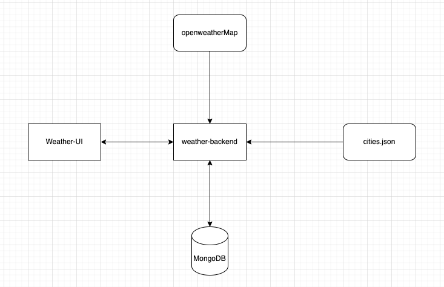
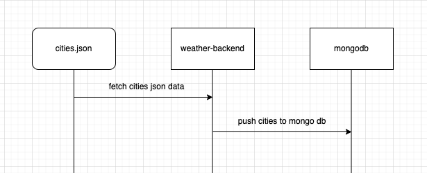
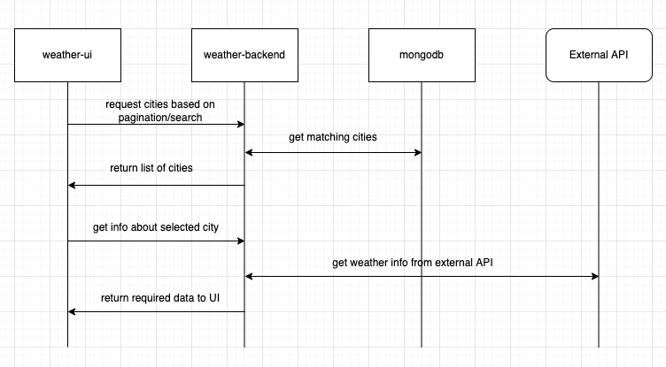
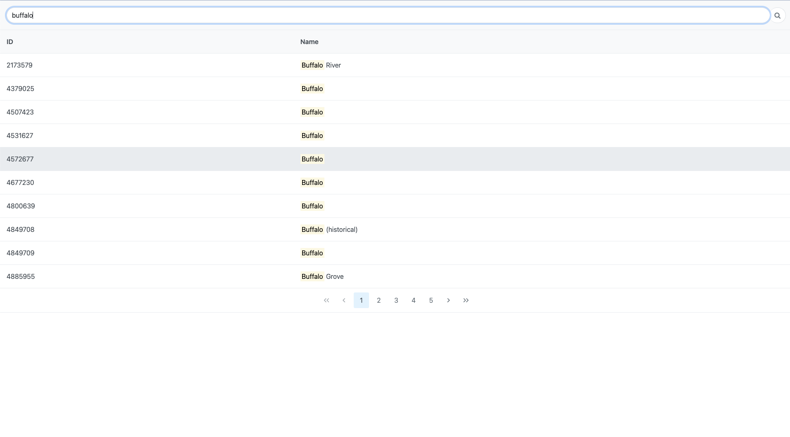
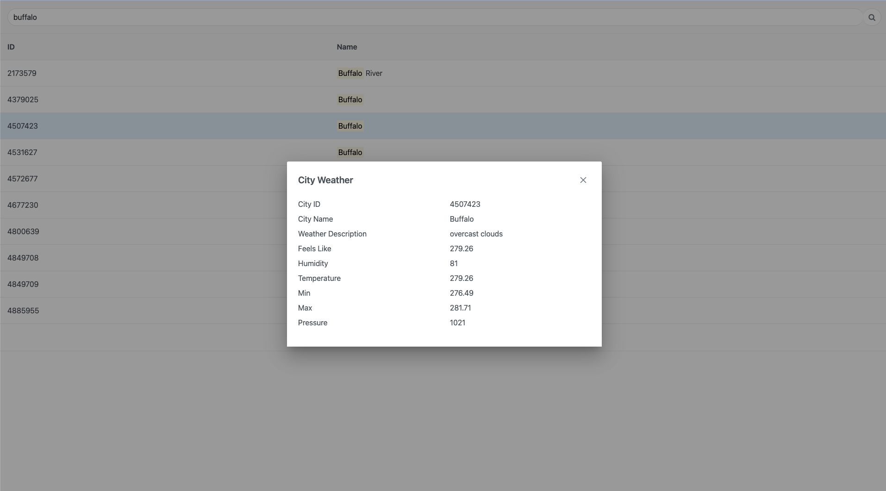

# weather app

 

### Repository contains the following files
- weather-backend
- weather-ui

 

### Architecture Diagram 

 

### Sequence Diagrams

* Loading Cities Data to DB
    > 

* UI Flow
    > 

 

### High Level explanation of flow

* User is displayed with a table view of cities fetched from the backend, with capabilities of searching and pagination.
* User selects a city for which they need weather info about.
* Pop up is dislplayed showing weather info about the City fetched from the External API

 

### UI Screenshots

* Cities Table Load UI
    > 

* Weather Info of City UI
    > 

 

### Stack used:
- weather-ui: Angular 12
- weather-backend: Python, flask
- Database: MongoDb

 

### Steps To run application
    
    To run the backend run the following command in the weather-backend directory:
    Add the mongo db connection string in the database_connection.py file
        python3 weather-backend.py

    To run the frontend run the following commands in weather-ui directory:
        npm install
        npm run build
        npm start

UI can be seen in http://localhost:8080
